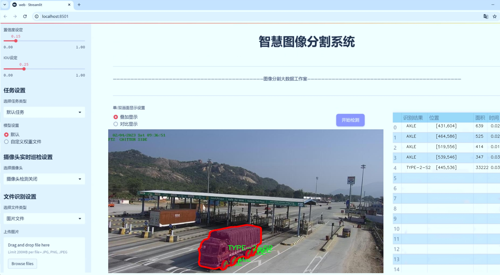
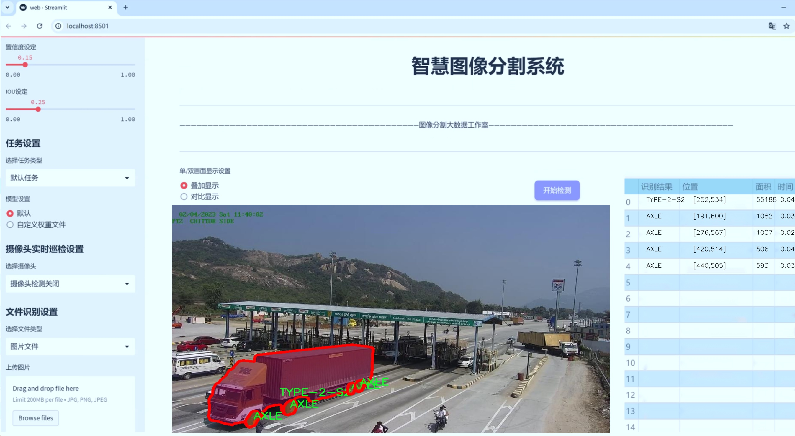
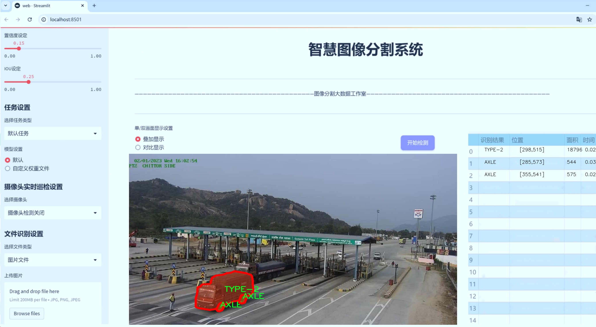
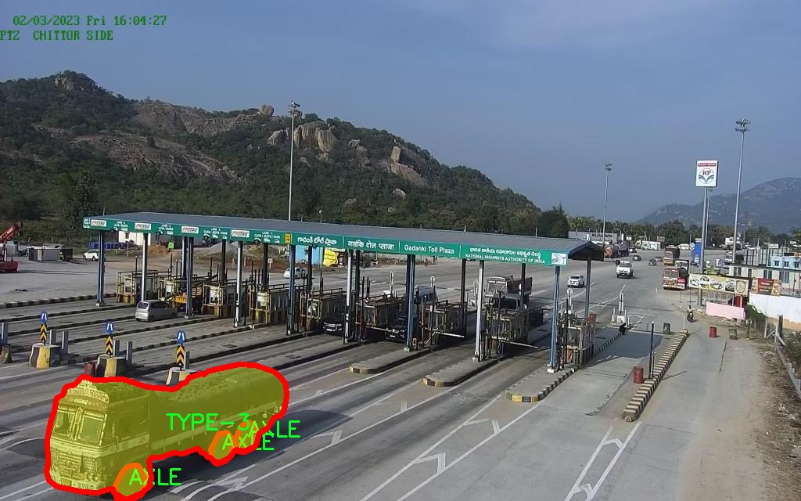
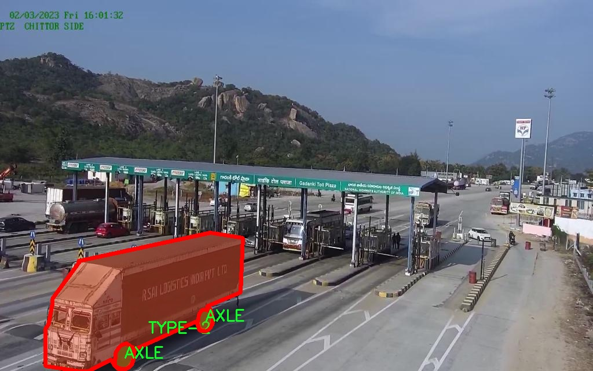
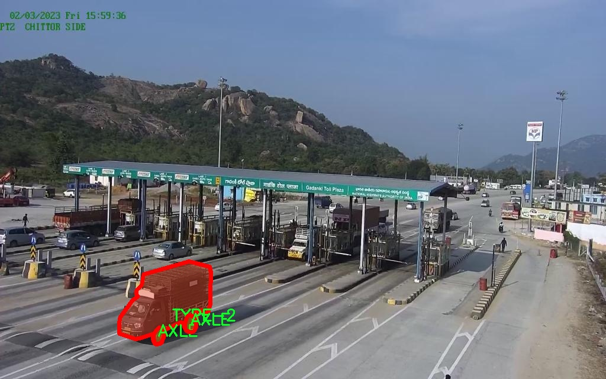
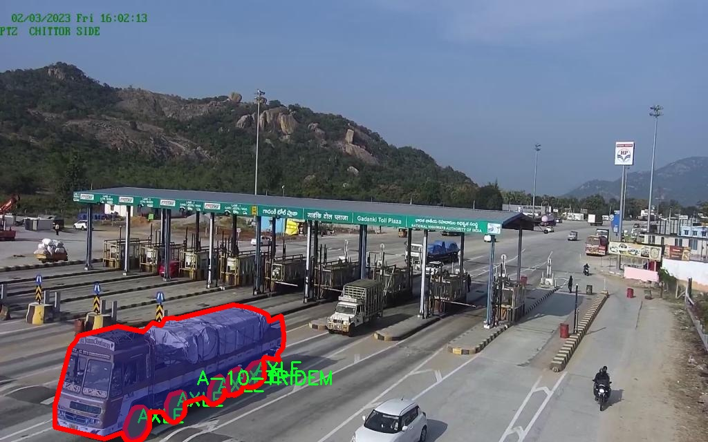
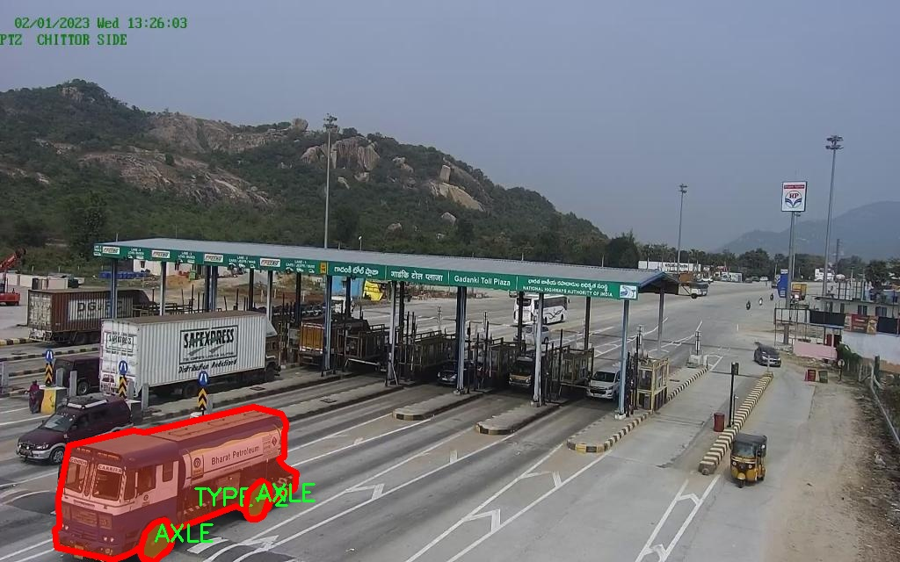

# 收费站监控重型车辆图像分割系统： yolov8-seg-C2f-REPVGGOREPA

### 1.研究背景与意义

[参考博客](https://gitee.com/YOLOv8_YOLOv11_Segmentation_Studio/projects)

[博客来源](https://kdocs.cn/l/cszuIiCKVNis)

研究背景与意义

随着城市化进程的加快和交通运输需求的不断增加，重型车辆在公路交通中扮演着越来越重要的角色。然而，重型车辆的增多也带来了交通管理和安全监控的诸多挑战，尤其是在收费站等关键节点。传统的监控手段往往依赖人工观察，效率低下且容易出现漏检和误检现象。因此，开发一种高效、准确的重型车辆监控系统显得尤为重要。

近年来，深度学习技术的迅猛发展为图像处理和计算机视觉领域带来了新的机遇。YOLO（You Only Look Once）系列模型因其实时性和高准确率而受到广泛关注，尤其是在目标检测和图像分割任务中表现出色。YOLOv8作为该系列的最新版本，结合了多种先进的深度学习技术，具备了更强的特征提取能力和更高的处理速度。基于YOLOv8的重型车辆监控系统，能够实现对收费站区域内重型车辆的快速检测与精确分割，从而为交通管理提供有力支持。

本研究的核心在于改进YOLOv8模型，以适应收费站监控重型车辆的特定需求。我们使用的数据集包含7700张图像，涵盖18个类别的重型车辆，包括不同类型的拖车、轴数及车辆分类。这一丰富的数据集为模型的训练和验证提供了坚实的基础，确保了模型在多样化场景下的鲁棒性和准确性。通过对数据集的深入分析，我们可以识别出不同类型重型车辆的特征，从而优化模型的参数设置和训练策略。

在研究意义方面，基于改进YOLOv8的收费站监控重型车辆图像分割系统不仅能够提高收费站的管理效率，还能为交通安全提供保障。通过实时监控和数据分析，系统能够及时识别和处理超载、违规等问题，减少交通事故的发生。此外，该系统的推广应用还将推动智能交通系统的发展，促进交通管理的数字化和智能化转型。

综上所述，本研究不仅具有重要的理论价值，还具备广泛的应用前景。通过构建高效的重型车辆监控系统，我们希望能够为交通管理提供新的解决方案，提升交通安全和效率，为未来的智能交通系统建设奠定基础。

### 2.图片演示







注意：本项目提供完整的训练源码数据集和训练教程,由于此博客编辑较早,暂不提供权重文件（best.pt）,需要按照6.训练教程进行训练后实现上图效果。

### 3.视频演示

[3.1 视频演示](https://www.bilibili.com/video/BV1hyUtY4Ei1/)

### 4.数据集信息

##### 4.1 数据集类别数＆类别名

nc: 8
names: ['A-10-S-TANDEM', 'A-10-TRIDEM', 'AXLE', 'COMBINED', 'TYPE-2', 'TYPE-2-S2', 'TYPE-3', 'UC']


##### 4.2 数据集信息简介

数据集信息展示

在本研究中，我们使用了名为“Heavy Vehicle Detection - NHAI Interns”的数据集，旨在训练和改进YOLOv8-seg模型，以实现对收费站监控中重型车辆的高效图像分割。该数据集专门为重型车辆检测而设计，包含丰富的样本和多样的类别，为模型的训练提供了坚实的基础。

该数据集包含8个类别，具体类别包括：A-10-S-TANDEM、A-10-TRIDEM、AXLE、COMBINED、TYPE-2、TYPE-2-S2、TYPE-3和UC。这些类别涵盖了不同类型的重型车辆，能够有效地反映收费站环境中可能出现的各种情况。每个类别都具有独特的特征和形态，能够帮助模型学习到更为细致的图像分割能力。例如，A-10-S-TANDEM和A-10-TRIDEM分别代表不同配置的重型卡车，AXLE则关注于车辆的轴数特征，而COMBINED则可能涉及多种车辆的组合形态。这种多样性不仅提高了模型的适应性，也增强了其在实际应用中的准确性。

数据集中的样本经过精心标注，确保每个类别的车辆在图像中都能被准确识别和分割。通过使用高质量的图像和详细的标注信息，我们能够有效地训练YOLOv8-seg模型，使其在面对复杂的交通场景时，依然能够保持较高的分割精度。这对于收费站的监控系统尤为重要，因为在实际应用中，车辆的种类和形态多种多样，模型必须具备足够的灵活性和鲁棒性，以应对不同的挑战。

此外，数据集的构建考虑到了实际应用中的各种场景，例如不同的天气条件、光照变化以及车辆的行驶状态等。这些因素都可能影响图像的质量和车辆的可见性，因此在数据集的设计中，尽可能地模拟了这些现实情况，以提高模型的泛化能力。通过在多样化的环境中进行训练，YOLOv8-seg模型能够更好地适应真实世界中的复杂情况，从而在收费站监控中实现更为精准的重型车辆检测和分割。

在训练过程中，我们将数据集划分为训练集和验证集，以便于对模型的性能进行评估和调优。通过不断迭代和优化，我们期望能够显著提升模型在重型车辆图像分割任务中的表现，使其不仅能够快速识别不同类型的车辆，还能在图像中准确地进行分割，为后续的收费管理和交通监控提供有力支持。

综上所述，“Heavy Vehicle Detection - NHAI Interns”数据集为本研究提供了丰富的样本和多样的类别，使得YOLOv8-seg模型的训练得以顺利进行。通过对该数据集的深入分析和应用，我们期望能够推动重型车辆监控技术的发展，为智能交通系统的建设贡献一份力量。











### 5.项目依赖环境部署教程（零基础手把手教学）

[5.1 环境部署教程链接（零基础手把手教学）](https://www.bilibili.com/video/BV1jG4Ve4E9t/?vd_source=bc9aec86d164b67a7004b996143742dc)


[5.2 安装Python虚拟环境创建和依赖库安装视频教程链接（零基础手把手教学）](https://www.bilibili.com/video/BV1nA4VeYEze/?vd_source=bc9aec86d164b67a7004b996143742dc)

### 6.手把手YOLOV8-seg训练视频教程（零基础手把手教学）

[6.1 手把手YOLOV8-seg训练视频教程（零基础小白有手就能学会）](https://www.bilibili.com/video/BV1cA4VeYETe/?vd_source=bc9aec86d164b67a7004b996143742dc)


按照上面的训练视频教程链接加载项目提供的数据集，运行train.py即可开始训练



     Epoch   gpu_mem       box       obj       cls    labels  img_size
     1/200     0G   0.01576   0.01955  0.007536        22      1280: 100%|██████████| 849/849 [14:42<00:00,  1.04s/it]
               Class     Images     Labels          P          R     mAP@.5 mAP@.5:.95: 100%|██████████| 213/213 [01:14<00:00,  2.87it/s]
                 all       3395      17314      0.994      0.957      0.0957      0.0843

     Epoch   gpu_mem       box       obj       cls    labels  img_size
     2/200     0G   0.01578   0.01923  0.007006        22      1280: 100%|██████████| 849/849 [14:44<00:00,  1.04s/it]
               Class     Images     Labels          P          R     mAP@.5 mAP@.5:.95: 100%|██████████| 213/213 [01:12<00:00,  2.95it/s]
                 all       3395      17314      0.996      0.956      0.0957      0.0845

     Epoch   gpu_mem       box       obj       cls    labels  img_size
     3/200     0G   0.01561    0.0191  0.006895        27      1280: 100%|██████████| 849/849 [10:56<00:00,  1.29it/s]
               Class     Images     Labels          P          R     mAP@.5 mAP@.5:.95: 100%|███████   | 187/213 [00:52<00:00,  4.04it/s]
                 all       3395      17314      0.996      0.957      0.0957      0.0845


### 7.50+种全套YOLOV8-seg创新点加载调参实验视频教程（一键加载写好的改进模型的配置文件）

[7.1 50+种全套YOLOV8-seg创新点加载调参实验视频教程（一键加载写好的改进模型的配置文件）](https://www.bilibili.com/video/BV1Hw4VePEXv/?vd_source=bc9aec86d164b67a7004b996143742dc)

### YOLOV8-seg算法简介

原始YOLOv8-seg算法原理

YOLOv8-seg算法是YOLO系列中的最新版本，旨在实现高效的目标检测与分割任务。其设计理念源于对YOLOv5和YOLOv7的深入研究，融合了多种先进的网络结构和算法优化技术，以提升模型的性能和适应性。YOLOv8-seg的网络架构主要由输入层、主干网络、颈部网络和头部网络四个核心部分构成，每个部分在整体模型中扮演着至关重要的角色。

在输入层，YOLOv8-seg首先对输入图像进行缩放处理，以满足指定的输入尺寸要求。这一过程确保了不同尺寸的图像能够被统一处理，从而提高了模型的适用性和灵活性。接下来，主干网络负责从输入图像中提取特征。YOLOv8-seg的主干网络采用了CSPDarknet结构，结合了卷积操作和批归一化，使用SiLU激活函数来增强非线性变换能力。通过多个卷积层的下采样，主干网络能够有效提取出图像中的重要特征信息。

在主干网络的设计中，YOLOv8-seg引入了C2f模块，这一模块借鉴了YOLOv7中的E-ELAN结构，通过跨层分支连接来增强模型的梯度流。C2f模块由多个CBS模块和瓶颈结构组成，其设计旨在解决深层网络中的梯度消失和梯度爆炸问题。通过这种方式，YOLOv8-seg能够在保证模型轻量化的同时，提升检测精度和特征提取能力。主干网络的末尾采用了SPPFl模块，利用多个最大池化层来处理多尺度特征，进一步增强了网络的特征抽象能力。

颈部网络则负责将主干网络提取的特征进行融合，采用了PAN-FPN结构，以实现不同尺度特征图的信息整合。通过这种结构，YOLOv8-seg能够有效捕捉到目标在不同尺度下的特征信息，增强了模型对小目标和大目标的检测能力。颈部网络的设计使得特征图在经过多个层次的融合后，能够保留丰富的语义信息和细节信息，为后续的目标检测和分割任务奠定了基础。

在头部网络中，YOLOv8-seg采用了解耦的检测头设计，通过两个并行的卷积分支分别计算回归和分类的损失。这一设计理念源于对传统Anchor-Base方法的反思，YOLOv8-seg摒弃了以往的锚框机制，转而采用Anchor-Free的思想，使得模型在处理不同形状和尺寸的目标时更加灵活。头部网络的输出包括多个尺度的特征图，分别用于目标的分类和边框回归。

为了进一步提升模型的性能，YOLOv8-seg在损失函数的设计上进行了创新，采用了VFLLoss作为分类损失，并结合DFLLoss和CIoULoss来计算回归损失。这种多损失函数的组合能够有效应对样本不平衡和困难样本的问题，提升模型的整体检测精度。此外，YOLOv8-seg还引入了Task-Aligned的样本匹配策略，以动态调整训练过程中样本的匹配方式，进一步提高了模型的训练效率和效果。

在数据预处理阶段，YOLOv8-seg借鉴了YOLOv5的策略，采用了多种数据增强手段，如马赛克增强、混合增强、空间扰动和颜色扰动等。这些增强手段能够有效提升模型的鲁棒性，使其在不同环境和条件下都能保持良好的检测性能。

综上所述，YOLOv8-seg算法通过对网络结构的精心设计和多种技术的综合应用，成功实现了高效的目标检测与分割任务。其在主干网络、颈部网络和头部网络的设计上均体现了对特征提取、信息融合和损失计算的深刻理解，使得YOLOv8-seg在实际应用中具备了更强的适应性和更高的精度。这一算法的推出，不仅为目标检测领域带来了新的思路，也为后续的研究和应用提供了丰富的参考。


### 9.系统功能展示（检测对象为举例，实际内容以本项目数据集为准）

图9.1.系统支持检测结果表格显示

  图9.2.系统支持置信度和IOU阈值手动调节

  图9.3.系统支持自定义加载权重文件best.pt(需要你通过步骤5中训练获得)

  图9.4.系统支持摄像头实时识别

  图9.5.系统支持图片识别

  图9.6.系统支持视频识别

  图9.7.系统支持识别结果文件自动保存

  图9.8.系统支持Excel导出检测结果数据


### 10.50+种全套YOLOV8-seg创新点原理讲解（非科班也可以轻松写刊发刊，V11版本正在科研待更新）

#### 10.1 由于篇幅限制，每个创新点的具体原理讲解就不一一展开，具体见下列网址中的创新点对应子项目的技术原理博客网址【Blog】：


[10.1 50+种全套YOLOV8-seg创新点原理讲解链接](https://gitee.com/qunmasj/good)

#### 10.2 部分改进模块原理讲解(完整的改进原理见上图和技术博客链接)【如果此小节的图加载失败可以通过CSDN或者Github搜索该博客的标题访问原始博客，原始博客图片显示正常】
### YOLOv8简介
YOLOv8目标检测算法继承了YOLOv1 系列的思考,是一种新型端到端的目标检测算法,尽管现在原始检测算法已经开源,但是鲜有发表的相关论文.YOLOv8的网络结构如图1[1所示,主要可分为Input输入端、Backbone 骨干神经网络、Neck混合特征网络层和 Head预测层网络共4个部分.

输入端( input)方法包含的功能模块有:马赛克( mosaic)数据增强、自适应锚框( anchor)计算、自适应图片缩放和 Mixup 数据增强['6].马赛克数据增强包括3种方式:缩放,色彩空间调整和马赛克增强.
该方法通过将4张图像进行随机的缩放﹑裁剪和打乱分布方式等操作来重新拼接图像,可丰富检测的数据集,具体步骤可见图2.随机缩放增加的许多小目标,非常适于解决卫星数据往往因距离目标过远从而导致图像中几乎都是小目标这一问题.在自适应锚框计算中, YOLO算法在每次训练数据之前,都会根据标注信息自动计算该数据集最合适的锚框尺寸,然后自动匹配最佳锚框.而自适应图片缩放只在检测时使用,由于不同场景需求不同,因而基于缩放系数YOLOv8提供了多尺度的不同大小模型.Mixup 数据增强鼓励模型对训练样本有一个线性的理解,具体做法是在目标检测中将两幅图像的像素值按照图像透明度的通道信息( alpha值)进行线性融合,对于标签box的处理直接采用拼接( con-cat)的方法拼接到一起.


Backbone骨干网络指用来提取图像特征的网络,整体结构包括注意力机制( focus)模块、跨阶段局部网络[ 7] ( cross stage partial network , CSP)和空间金字塔池化结构( spatial pyramid pooling,SPP).其中, Focus模块的作用是在图片进入 Backbone骨干网络前,对图片进行切片操作,即在一张图片中每隔一个像素取一个值,获得4张互补的图片,最后将新生成的图片经过卷积操作,得到没有信息丢失的2倍下采样特征图.YOLOv8使用了CSPNet 中的C2f网络,网络见图3,其中 CBS 就是卷积层,而瓶颈层( bottleneck layer)使用的是1* 1的卷积神经网络.C2f网络在保证轻量化的同时获得更加丰富的梯度流信息.而SPP结构是空间金字塔池化,能将任意大小的特征图转换成固定大小的特征向量,即把输入的特征地图划分为多个尺度,然后对每个图进行最大池化,再将提取的特征值拼接起来成为一维向量,输入SPP层获取分类.


Neck 结构如图4所示,它是由卷积层和C2f模块组成的的网络层,采用了路径聚合网络( path ag-gregation network ,PAN)和特征金字塔网络( featurepyramid networks , FPN)的结构对特征进行多尺度融合,目标是将图像特征传递到预测层.其中 PAN结构指图4左半边,它自底向上进行下采样,使顶层特征包含图像位置信息,两个特征最后进行融合,使不同尺寸的特征图都包含图像语义信息和图像特征信息，保证了网络对不同尺寸的图片的准确预测.而FPN结构指图4右半边,指通过自顶向下进行上采样,将高层特征与底层特征进行融合,从而同时利用低层特征的高分辨率和高层特征的丰富语义信息,并进行了多尺度特征的独立预测,对小物体的检测效果有明显的提升.从 FPN模块的基础上看,它增加了自底向上的特征金字塔结构,保留了更多的浅层位置特征,将整体特征提取能力进一步提升.


Head的结构如图5所示,在该结构中 YOLOv8采用了解耦检测头( decoupled-head )[ 18],因为分类和定位的关注点不同,分类更关注目标的纹理内容而定位更关注目标的边缘信息.因而解耦头结构考虑到分类和定位所关注的内容的不同,采用不同的分支来进行运算,提升了检测效果,相对应的回归头的通道数也改变了.


### MS-Block简介
实时目标检测，以YOLO系列为例，已在工业领域中找到重要应用，特别是在边缘设备（如无人机和机器人）中。与之前的目标检测器不同，实时目标检测器旨在在速度和准确性之间追求最佳平衡。为了实现这一目标，提出了大量的工作：从第一代DarkNet到CSPNet，再到最近的扩展ELAN，随着性能的快速增长，实时目标检测器的架构经历了巨大的变化。

尽管性能令人印象深刻，但在不同尺度上识别对象仍然是实时目标检测器面临的基本挑战。这促使作者设计了一个强大的编码器架构，用于学习具有表现力的多尺度特征表示。具体而言，作者从两个新的角度考虑为实时目标检测编码多尺度特征：

从局部视角出发，作者设计了一个具有简单而有效的分层特征融合策略的MS-Block。受到Res2Net的启发，作者在MS-Block中引入了多个分支来进行特征提取，但不同的是，作者使用了一个带有深度卷积的 Inverted Bottleneck Block块，以实现对大Kernel的高效利用。

从全局视角出发，作者提出随着网络加深逐渐增加卷积的Kernel-Size。作者在浅层使用小Kernel卷积来更高效地处理高分辨率特征。另一方面，在深层中，作者采用大Kernel卷积来捕捉广泛的信息。

基于以上设计原则，作者呈现了作者的实时目标检测器，称为YOLO-MS。为了评估作者的YOLO-MS的性能，作者在MS COCO数据集上进行了全面的实验。还提供了与其他最先进方法的定量比较，以展示作者方法的强大性能。如图1所示，YOLO-MS在计算性能平衡方面优于其他近期的实时目标检测器。


具体而言，YOLO-MS-XS在MS COCO上获得了43%+的AP得分，仅具有450万个可学习参数和8.7亿个FLOPs。YOLO-MS-S和YOLO-MS分别获得了46%+和51%+的AP，可学习参数分别为810万和2220万。此外，作者的工作还可以作为其他YOLO模型的即插即用模块。通常情况下，作者的方法可以将YOLOv8的AP从37%+显著提高到40%+，甚至还可以使用更少的参数和FLOPs。

CSP Block是一个基于阶段级梯度路径的网络，平衡了梯度组合和计算成本。它是广泛应用于YOLO系列的基本构建块。已经提出了几种变体，包括YOLOv4和YOLOv5中的原始版本，Scaled YOLOv4中的CSPVoVNet，YOLOv7中的ELAN，以及RTMDet中提出的大Kernel单元。作者在图2(a)和图2(b)中分别展示了原始CSP块和ELAN的结构。


上述实时检测器中被忽视的一个关键方面是如何在基本构建块中编码多尺度特征。其中一个强大的设计原则是Res2Net，它聚合了来自不同层次的特征以增强多尺度表示。然而，这一原则并没有充分探索大Kernel卷积的作用，而大Kernel卷积已经在基于CNN的视觉识别任务模型中证明有效。将大Kernel卷积纳入Res2Net的主要障碍在于它们引入的计算开销，因为构建块采用了标准卷积。在作者的方法中，作者提出用 Inverted Bottleneck Block替代标准的3 × 3卷积，以享受大Kernel卷积的好处。

#### MS-Block

基于前面的分析，参考该博客提出了一个带有分层特征融合策略的全新Block，称为MS-Block，以增强实时目标检测器在提取多尺度特征时的能力，同时保持快速的推理速度。

MS-Block的具体结构如图2(c)所示。假设是输入特征。通过1×1卷积的转换后，X的通道维度增加到n*C。然后，作者将X分割成n个不同的组，表示为，其中。为了降低计算成本，作者选择n为3。

注意，除了之外，每个其他组都经过一个 Inverted Bottleneck Block层，用表示，其中k表示Kernel-Size，以获得。的数学表示如下：


根据这个公式，作者不将 Inverted Bottleneck Block层连接到，使其作为跨阶段连接，并保留来自前面层的信息。最后，作者将所有分割连接在一起，并应用1×1卷积来在所有分割之间进行交互，每个分割都编码不同尺度的特征。当网络加深时，这个1×1卷积也用于调整通道数。

#### Heterogeneous Kernel Selection Protocol
除了构建块的设计外，作者还从宏观角度探讨了卷积的使用。之前的实时目标检测器在不同的编码器阶段采用了同质卷积（即具有相同Kernel-Size的卷积），但作者认为这不是提取多尺度语义信息的最佳选项。

在金字塔结构中，从检测器的浅阶段提取的高分辨率特征通常用于捕捉细粒度语义，将用于检测小目标。相反，来自网络较深阶段的低分辨率特征用于捕捉高级语义，将用于检测大目标。如果作者在所有阶段都采用统一的小Kernel卷积，深阶段的有效感受野（ERF）将受到限制，影响大目标的性能。在每个阶段中引入大Kernel卷积可以帮助解决这个问题。然而，具有大的ERF的大Kernel可以编码更广泛的区域，这增加了在小目标外部包含噪声信息的概率，并且降低了推理速度。

在这项工作中，作者建议在不同阶段中采用异构卷积，以帮助捕获更丰富的多尺度特征。具体来说，在编码器的第一个阶段中，作者采用最小Kernel卷积，而最大Kernel卷积位于最后一个阶段。随后，作者逐步增加中间阶段的Kernel-Size，使其与特征分辨率的增加保持一致。这种策略允许提取细粒度和粗粒度的语义信息，增强了编码器的多尺度特征表示能力。

正如图所示，作者将k的值分别分配给编码器中的浅阶段到深阶段，取值为3、5、7和9。作者将其称为异构Kernel选择（HKS）协议。


作者的HKS协议能够在深层中扩大感受野，而不会对浅层产生任何其他影响。第4节的图4支持了作者的分析。此外，HKS不仅有助于编码更丰富的多尺度特征，还确保了高效的推理。

如表1所示，将大Kernel卷积应用于高分辨率特征会产生较高的计算开销。然而，作者的HKS协议在低分辨率特征上采用大Kernel卷积，从而与仅使用大Kernel卷积相比，大大降低了计算成本。


在实践中，作者经验性地发现，采用HKS协议的YOLO-MS的推理速度几乎与仅使用深度可分离的3 × 3卷积相同。


如图所示，作者模型的Backbone由4个阶段组成，每个阶段后面跟随1个步长为2的3 × 3卷积进行下采样。在第3个阶段后，作者添加了1个SPP块，与RTMDet中一样。在作者的编码器上，作者使用PAFPN作为Neck来构建特征金字塔[31, 35]。它融合了从Backbone不同阶段提取的多尺度特征。Neck中使用的基本构建块也是作者的MS-Block，在其中使用3 × 3深度可分离卷积进行快速推理。

此外，为了在速度和准确性之间取得更好的平衡，作者将Backbone中多级特征的通道深度减半。作者提供了3个不同尺度的YOLO-MS变体，即YOLO-MS-XS、YOLO-MS-S和YOLO-MS。不同尺度的YOLO-MS的详细配置列在表2中。对于YOLO-MS的其他部分，作者将其保持与RTMDet相同。


### 11.项目核心源码讲解（再也不用担心看不懂代码逻辑）

#### 11.1 ultralytics\models\rtdetr\val.py

以下是经过简化和注释的核心代码部分，保留了主要功能和逻辑：

```python
# Ultralytics YOLO 🚀, AGPL-3.0 license

from pathlib import Path
import torch
from ultralytics.data import YOLODataset
from ultralytics.models.yolo.detect import DetectionValidator
from ultralytics.utils import ops

class RTDETRDataset(YOLODataset):
    """
    RT-DETR数据集类，继承自YOLODataset类，专为实时检测和跟踪任务设计。
    """

    def __init__(self, *args, data=None, **kwargs):
        """初始化RTDETRDataset类，调用父类构造函数。"""
        super().__init__(*args, data=data, use_segments=False, use_keypoints=False, **kwargs)

    def load_image(self, i, rect_mode=False):
        """加载数据集中索引为'i'的图像，返回图像及其调整后的尺寸。"""
        return super().load_image(i=i, rect_mode=rect_mode)

    def build_transforms(self, hyp=None):
        """构建数据增强变换，仅用于评估。"""
        transforms = []
        if self.augment:
            # 根据超参数设置增强方式
            transforms = v8_transforms(self, self.imgsz, hyp, stretch=True)
        transforms.append(
            ops.Format(bbox_format='xywh', normalize=True, return_mask=self.use_segments, return_keypoint=self.use_keypoints)
        )
        return transforms


class RTDETRValidator(DetectionValidator):
    """
    RTDETRValidator类，扩展DetectionValidator，提供专门针对RT-DETR模型的验证功能。
    """

    def build_dataset(self, img_path, mode='val', batch=None):
        """
        构建RTDETR数据集。

        Args:
            img_path (str): 图像文件夹路径。
            mode (str): 模式（训练或验证）。
            batch (int, optional): 批量大小。
        """
        return RTDETRDataset(
            img_path=img_path,
            imgsz=self.args.imgsz,
            batch_size=batch,
            augment=False,  # 不进行数据增强
            hyp=self.args,
            rect=False,  # 不使用矩形模式
            cache=self.args.cache or None,
            data=self.data
        )

    def postprocess(self, preds):
        """对预测结果应用非极大值抑制（NMS）。"""
        bs, _, nd = preds[0].shape  # bs: batch size, nd: number of detections
        bboxes, scores = preds[0].split((4, nd - 4), dim=-1)  # 分离边界框和分数
        bboxes *= self.args.imgsz  # 将边界框调整到原始图像尺寸
        outputs = [torch.zeros((0, 6), device=bboxes.device)] * bs  # 初始化输出

        for i, bbox in enumerate(bboxes):
            bbox = ops.xywh2xyxy(bbox)  # 转换为xyxy格式
            score, cls = scores[i].max(-1)  # 获取最大分数和对应类别
            pred = torch.cat([bbox, score[..., None], cls[..., None]], dim=-1)  # 合并边界框、分数和类别
            pred = pred[score.argsort(descending=True)]  # 按分数排序
            outputs[i] = pred  # 保存结果

        return outputs

    def update_metrics(self, preds, batch):
        """更新评估指标。"""
        for si, pred in enumerate(preds):
            idx = batch['batch_idx'] == si  # 获取当前batch的索引
            cls = batch['cls'][idx]  # 获取当前batch的真实类别
            bbox = batch['bboxes'][idx]  # 获取当前batch的真实边界框
            nl, npr = cls.shape[0], pred.shape[0]  # nl: 标签数量, npr: 预测数量
            shape = batch['ori_shape'][si]  # 获取原始图像的形状
            correct_bboxes = torch.zeros(npr, self.niou, dtype=torch.bool, device=self.device)  # 初始化正确边界框

            if npr == 0:  # 如果没有预测
                if nl:
                    self.stats.append((correct_bboxes, *torch.zeros((2, 0), device=self.device), cls.squeeze(-1)))
                continue

            predn = pred.clone()  # 复制预测结果
            predn[..., [0, 2]] *= shape[1] / self.args.imgsz  # 将预测边界框转换为原始空间
            predn[..., [1, 3]] *= shape[0] / self.args.imgsz  # 将预测边界框转换为原始空间

            if nl:  # 如果有真实标签
                tbox = ops.xywh2xyxy(bbox)  # 转换真实边界框为xyxy格式
                labelsn = torch.cat((cls, tbox), 1)  # 合并真实类别和边界框
                correct_bboxes = self._process_batch(predn.float(), labelsn)  # 处理批次以更新正确边界框

            self.stats.append((correct_bboxes, pred[:, 4], pred[:, 5], cls.squeeze(-1)))  # 更新统计信息
```

### 代码注释说明：
1. **RTDETRDataset**: 这是一个专门为RT-DETR模型设计的数据集类，继承自YOLODataset。它重写了加载图像和构建变换的方法，以适应实时检测和跟踪的需求。
2. **RTDETRValidator**: 这是一个验证器类，扩展了DetectionValidator，专门用于RT-DETR模型的验证。它包括构建数据集、后处理预测结果和更新评估指标的方法。
3. **postprocess**: 该方法实现了非极大值抑制（NMS），用于过滤掉重叠的边界框，只保留最有可能的检测结果。
4. **update_metrics**: 该方法用于更新模型的评估指标，包括计算正确的边界框和处理预测结果与真实标签的比较。

该文件 `val.py` 是 Ultralytics YOLO 框架的一部分，主要用于实现 RT-DETR（实时检测与跟踪）模型的验证功能。文件中定义了两个主要的类：`RTDETRDataset` 和 `RTDETRValidator`，它们分别负责数据集的加载和验证过程。

`RTDETRDataset` 类继承自 `YOLODataset`，专门为 RT-DETR 模型设计。它的构造函数调用了父类的构造函数，并禁用了分段和关键点的使用。该类重写了 `load_image` 方法，以加载指定索引的图像，并返回图像及其调整后的尺寸。此外，`build_transforms` 方法用于构建图像变换，支持不同的增强策略，尤其是在评估时，它可以选择是否应用增强。最终，它会返回一个变换列表，其中包括格式化边界框的操作。

`RTDETRValidator` 类则继承自 `DetectionValidator`，提供了专门针对 RT-DETR 模型的验证功能。它的 `build_dataset` 方法用于构建 RT-DETR 数据集，接受图像路径、模式（训练或验证）和批次大小作为参数。该方法返回一个 `RTDETRDataset` 实例，并设置相关参数，如图像大小和数据增强选项。

在验证过程中，`postprocess` 方法应用非极大值抑制（NMS）来处理模型的预测输出。它将预测的边界框和分数分开，并将边界框调整为原始图像的尺寸。接着，它会根据分数对预测进行排序，并返回处理后的输出。

`update_metrics` 方法用于更新评估指标。它遍历每个预测结果，并根据真实标签计算正确的边界框。该方法还会处理混淆矩阵和保存预测结果到 JSON 或 TXT 文件中，具体取决于传入的参数。

总体而言，该文件实现了 RT-DETR 模型在验证阶段所需的功能，包括数据集的构建、图像的处理、预测结果的后处理以及评估指标的更新。这些功能使得用户能够有效地评估模型的性能。

#### 11.2 ultralytics\utils\callbacks\dvc.py

以下是代码中最核心的部分，并附上详细的中文注释：

```python
# 导入必要的库
from ultralytics.utils import LOGGER, SETTINGS, TESTS_RUNNING, checks

try:
    # 确保当前不是在运行测试
    assert not TESTS_RUNNING  
    # 确保DVC集成已启用
    assert SETTINGS['dvc'] is True  
    import dvclive  # 导入DVCLive库
    # 检查DVCLive版本
    assert checks.check_version('dvclive', '2.11.0', verbose=True)

    import os
    import re
    from pathlib import Path

    # 创建DVCLive日志实例
    live = None
    _processed_plots = {}  # 用于记录已处理的图表

    # 训练期间的标志，指示当前是否在训练周期
    _training_epoch = False

except (ImportError, AssertionError, TypeError):
    dvclive = None  # 如果导入失败，则将dvclive设置为None


def _log_images(path, prefix=''):
    """记录指定路径的图像，并可选地使用前缀。"""
    if live:  # 如果DVCLive实例存在
        name = path.name

        # 根据批次分组图像，以便在UI中启用滑块
        m = re.search(r'_batch(\d+)', name)
        if m:
            ni = m[1]
            new_stem = re.sub(r'_batch(\d+)', '_batch', path.stem)
            name = (Path(new_stem) / ni).with_suffix(path.suffix)

        # 记录图像
        live.log_image(os.path.join(prefix, name), path)


def on_train_epoch_start(trainer):
    """在每个训练周期开始时，将全局变量_training_epoch设置为True。"""
    global _training_epoch
    _training_epoch = True


def on_fit_epoch_end(trainer):
    """在每个训练周期结束时记录训练指标和模型信息，并推进到下一个步骤。"""
    global _training_epoch
    if live and _training_epoch:  # 如果DVCLive存在且当前在训练周期
        # 收集所有指标
        all_metrics = {**trainer.label_loss_items(trainer.tloss, prefix='train'), **trainer.metrics, **trainer.lr}
        for metric, value in all_metrics.items():
            live.log_metric(metric, value)  # 记录每个指标

        # 记录训练和验证的图表
        _log_plots(trainer.plots, 'train')
        _log_plots(trainer.validator.plots, 'val')

        live.next_step()  # 进入下一个步骤
        _training_epoch = False  # 重置训练周期标志


def on_train_end(trainer):
    """在训练结束时记录最佳指标、图表和混淆矩阵。"""
    if live:  # 如果DVCLive存在
        # 记录最佳指标
        all_metrics = {**trainer.label_loss_items(trainer.tloss, prefix='train'), **trainer.metrics, **trainer.lr}
        for metric, value in all_metrics.items():
            live.log_metric(metric, value, plot=False)  # 记录指标，不绘制图表

        # 记录验证图表和混淆矩阵
        _log_plots(trainer.plots, 'val')
        _log_confusion_matrix(trainer.validator)

        live.end()  # 结束日志记录


# 回调函数字典，用于在不同训练阶段调用相应的函数
callbacks = {
    'on_train_epoch_start': on_train_epoch_start,
    'on_fit_epoch_end': on_fit_epoch_end,
    'on_train_end': on_train_end} if dvclive else {}
```

### 代码核心部分说明：
1. **导入和初始化**：导入必要的库，并确保DVC集成已启用。如果导入失败，则将`dvclive`设置为`None`。
2. **图像记录**：`_log_images`函数用于记录图像，支持批次分组以便在UI中展示。
3. **训练周期管理**：通过`on_train_epoch_start`和`on_fit_epoch_end`函数管理训练周期的开始和结束，记录训练指标。
4. **训练结束处理**：`on_train_end`函数在训练结束时记录最佳指标和混淆矩阵，确保所有数据被正确记录。

这些核心部分共同构成了训练过程中的日志记录机制，确保模型训练的每个阶段都能被有效监控和记录。

这个程序文件是Ultralytics YOLO项目中的一个回调模块，主要用于集成DVCLive进行训练过程中的日志记录和可视化。文件中首先导入了一些必要的模块和库，包括日志记录器、设置、测试状态和版本检查等。接着，通过一系列的断言确保在非测试状态下运行，并且确认DVCLive集成已启用。如果DVCLive未能导入或配置不当，相关的功能将不会被激活。

文件中定义了一些私有函数，主要用于处理图像和绘图的日志记录。`_log_images`函数负责记录指定路径下的图像，并根据需要为图像名称添加前缀。`_log_plots`函数则用于记录训练过程中生成的绘图，确保每个绘图只被处理一次。`_log_confusion_matrix`函数用于记录混淆矩阵，这对于模型的性能评估非常重要。

在训练的不同阶段，文件中定义了一系列的回调函数，例如`on_pretrain_routine_start`和`on_pretrain_routine_end`，分别在预训练开始和结束时执行。这些函数主要用于初始化DVCLive日志记录器和记录训练过程中的绘图。`on_train_start`函数在训练开始时记录训练参数，而`on_train_epoch_start`函数则标记当前处于训练周期。

`on_fit_epoch_end`函数在每个训练周期结束时被调用，记录训练指标和模型信息，并进行下一步的日志记录。最后，`on_train_end`函数在训练结束时记录最佳指标、绘图和混淆矩阵，并结束DVCLive的日志记录。

整个模块的回调函数被存储在一个字典中，只有在DVCLive可用时才会被填充。这种设计使得代码在没有DVCLive的情况下仍然可以正常运行，而不会影响其他功能。

#### 11.3 ultralytics\models\yolo\pose\predict.py

以下是经过简化和注释的核心代码部分：

```python
# 导入必要的模块和类
from ultralytics.engine.results import Results
from ultralytics.models.yolo.detect.predict import DetectionPredictor
from ultralytics.utils import DEFAULT_CFG, LOGGER, ops

class PosePredictor(DetectionPredictor):
    """
    PosePredictor类，继承自DetectionPredictor，用于基于姿态模型的预测。
    """

    def __init__(self, cfg=DEFAULT_CFG, overrides=None, _callbacks=None):
        """初始化PosePredictor，设置任务为'pose'并记录关于使用'mps'作为设备的警告。"""
        super().__init__(cfg, overrides, _callbacks)  # 调用父类构造函数
        self.args.task = 'pose'  # 设置任务为姿态检测
        # 检查设备是否为Apple MPS，如果是，则发出警告
        if isinstance(self.args.device, str) and self.args.device.lower() == 'mps':
            LOGGER.warning("WARNING ⚠️ Apple MPS known Pose bug. Recommend 'device=cpu' for Pose models. "
                           'See https://github.com/ultralytics/ultralytics/issues/4031.')

    def postprocess(self, preds, img, orig_imgs):
        """对给定输入图像或图像列表返回检测结果。"""
        # 应用非极大值抑制（NMS）来过滤预测框
        preds = ops.non_max_suppression(preds,
                                        self.args.conf,  # 置信度阈值
                                        self.args.iou,   # IOU阈值
                                        agnostic=self.args.agnostic_nms,  # 是否类别无关
                                        max_det=self.args.max_det,  # 最大检测数量
                                        classes=self.args.classes,  # 选择的类别
                                        nc=len(self.model.names))  # 类别数量

        # 如果输入图像不是列表，则将其转换为numpy数组
        if not isinstance(orig_imgs, list):
            orig_imgs = ops.convert_torch2numpy_batch(orig_imgs)

        results = []  # 存储结果的列表
        for i, pred in enumerate(preds):
            orig_img = orig_imgs[i]  # 获取原始图像
            # 将预测框的坐标缩放到原始图像的尺寸
            pred[:, :4] = ops.scale_boxes(img.shape[2:], pred[:, :4], orig_img.shape).round()
            # 获取关键点预测并进行坐标缩放
            pred_kpts = pred[:, 6:].view(len(pred), *self.model.kpt_shape) if len(pred) else pred[:, 6:]
            pred_kpts = ops.scale_coords(img.shape[2:], pred_kpts, orig_img.shape)
            img_path = self.batch[0][i]  # 获取图像路径
            # 将结果添加到结果列表中
            results.append(
                Results(orig_img, path=img_path, names=self.model.names, boxes=pred[:, :6], keypoints=pred_kpts))
        return results  # 返回检测结果
```

### 代码说明：
1. **PosePredictor类**：这是一个用于姿态检测的预测器类，继承自`DetectionPredictor`，扩展了其功能。
2. **构造函数`__init__`**：初始化时设置任务类型为'pose'，并检查设备类型以发出相应的警告。
3. **`postprocess`方法**：处理模型的输出，应用非极大值抑制（NMS）来过滤检测框，并将预测框和关键点的坐标缩放到原始图像的尺寸，最终返回包含检测结果的列表。

这个程序文件定义了一个名为 `PosePredictor` 的类，它继承自 `DetectionPredictor` 类，主要用于基于姿态模型进行预测。该类的主要功能是处理输入图像，执行姿态检测，并返回检测结果。

在文件的开头，首先导入了一些必要的模块和类，包括 `Results`、`DetectionPredictor` 和一些工具函数。接着，定义了 `PosePredictor` 类，并在类的文档字符串中提供了一个使用示例，展示了如何创建 `PosePredictor` 的实例并调用其预测功能。

`PosePredictor` 类的构造函数 `__init__` 接受三个参数：`cfg`、`overrides` 和 `_callbacks`。在构造函数中，首先调用父类的构造函数以初始化基本设置。然后，将任务类型设置为 `'pose'`，并添加了一个警告，提醒用户在使用 Apple 的 MPS 设备时可能会遇到已知的姿态检测问题，建议使用 CPU 作为设备。

类中还定义了一个 `postprocess` 方法，该方法用于处理模型的预测结果。它接受三个参数：`preds`（模型的预测结果）、`img`（输入图像）和 `orig_imgs`（原始图像）。在该方法中，首先对预测结果进行非极大值抑制，以过滤掉低置信度的检测框。接着，如果输入的原始图像不是列表格式，则将其转换为 NumPy 数组格式。

随后，方法会遍历每个预测结果，调整检测框的坐标，使其与原始图像的尺寸相匹配，并提取关键点的坐标。最后，将每个图像的检测结果封装成 `Results` 对象，并将其添加到结果列表中。最终，该方法返回所有图像的检测结果。

总体来说，这个文件实现了一个姿态检测的预测器，能够处理输入图像并返回相应的检测结果，适用于需要姿态估计的计算机视觉任务。

#### 11.4 ultralytics\nn\extra_modules\attention.py

以下是代码中最核心的部分，并附上详细的中文注释：

```python
import torch
from torch import nn
import torch.nn.functional as F

class BiLevelRoutingAttention(nn.Module):
    """
    Bi-Level Routing Attention模块
    该模块实现了一种基于窗口的注意力机制，适用于图像处理任务。
    """
    def __init__(self, dim, num_heads=8, n_win=7, topk=4):
        super().__init__()
        self.dim = dim  # 输入特征的维度
        self.num_heads = num_heads  # 注意力头的数量
        self.n_win = n_win  # 每个维度的窗口数量
        self.topk = topk  # 在注意力计算中选择的top-k个元素

        # 定义线性层用于Q、K、V的映射
        self.qkv = nn.Linear(dim, dim * 3)  # 将输入特征映射到Q、K、V
        self.softmax = nn.Softmax(dim=-1)  # Softmax层用于归一化注意力权重

    def forward(self, x):
        """
        前向传播函数
        :param x: 输入特征，形状为(N, C, H, W)，N为批量大小，C为通道数，H和W为特征图的高度和宽度
        :return: 输出特征，形状与输入相同
        """
        N, C, H, W = x.size()  # 获取输入的形状
        # 将输入特征映射到Q、K、V
        qkv = self.qkv(x)  # 形状为(N, C, 3)
        q, k, v = qkv.chunk(3, dim=1)  # 分割为Q、K、V

        # 将Q、K、V重塑为窗口格式
        q = q.view(N, self.num_heads, -1, H // self.n_win, W // self.n_win)  # (N, num_heads, H/n_win, W/n_win)
        k = k.view(N, self.num_heads, -1, H // self.n_win, W // self.n_win)  # (N, num_heads, H/n_win, W/n_win)
        v = v.view(N, self.num_heads, -1, H // self.n_win, W // self.n_win)  # (N, num_heads, H/n_win, W/n_win)

        # 计算注意力权重
        attn_weights = torch.einsum('nhed,nfhd->nhf', q, k)  # 计算Q和K的点积
        attn_weights = self.softmax(attn_weights)  # 归一化权重

        # 使用注意力权重加权V
        out = torch.einsum('nhf,nfhd->nhed', attn_weights, v)  # 计算加权和
        return out.view(N, C, H, W)  # 重塑输出为原始形状

# 示例使用
# 创建一个BiLevelRoutingAttention实例
attention_layer = BiLevelRoutingAttention(dim=256, num_heads=8, n_win=7, topk=4)
# 假设输入特征图为随机生成的张量
input_tensor = torch.randn(1, 256, 56, 56)  # 1个样本，256个通道，56x56的特征图
# 通过注意力层
output_tensor = attention_layer(input_tensor)
```

### 代码说明：
1. **类定义**：`BiLevelRoutingAttention`类实现了双层路由注意力机制。
2. **初始化**：构造函数中定义了输入特征的维度、注意力头的数量、窗口数量以及top-k参数。使用线性层将输入特征映射到Q、K、V。
3. **前向传播**：在`forward`方法中，输入特征被映射到Q、K、V，并重塑为窗口格式。接着计算Q和K的点积以得到注意力权重，并通过Softmax进行归一化。最后，使用注意力权重加权V，得到输出特征。
4. **示例使用**：展示了如何创建`BiLevelRoutingAttention`实例并通过随机生成的输入特征图进行前向传播。

这个程序文件`ultralytics/nn/extra_modules/attention.py`主要实现了一些用于深度学习模型的注意力机制模块，特别是在计算机视觉任务中。文件中定义了多个类，每个类实现了一种特定的注意力机制或相关功能。以下是对文件中主要部分的详细讲解。

首先，文件导入了一些必要的库，包括`torch`及其子模块，`torchvision`，以及`efficientnet_pytorch`中的`MemoryEfficientSwish`。这些库提供了构建神经网络所需的基础组件和函数。

文件中定义的第一个类是`EMA`（Exponential Moving Average），它用于实现一种基于通道的注意力机制。该类通过对输入特征图进行分组处理，计算每个组的平均值，并使用卷积层和激活函数来生成权重。`forward`方法定义了前向传播的过程，其中输入特征图经过多次操作后，输出加权后的特征图。

接下来的类`SimAM`实现了一种简单的注意力机制，通过计算输入特征图的均值和方差来生成权重，并通过Sigmoid激活函数进行处理。该类的设计旨在通过简单的操作来增强特征图的表达能力。

`SpatialGroupEnhance`类则实现了一种空间增强机制，通过对输入特征图进行分组和池化，生成空间注意力权重，从而增强特征图的空间信息。

`TopkRouting`类实现了一种可微分的Top-k路由机制。该机制通过计算查询和键之间的相似度，选择最相关的Top-k特征进行后续处理。这种机制在处理大规模特征时非常有效。

`KVGather`类用于根据路由索引选择键值对（key-value pairs），并根据指定的权重进行加权。这个类在实现注意力机制时非常重要，因为它能够有效地聚合相关的特征信息。

`QKVLinear`类是一个简单的线性层，用于将输入特征映射到查询、键和值的空间。它通过线性变换生成注意力机制所需的三个部分。

`BiLevelRoutingAttention`类实现了一种双层路由注意力机制，结合了局部和全局的注意力计算。该类通过分块处理输入特征图，计算每个块的注意力权重，并将其应用于特征图的输出。

`CoordAtt`类实现了一种坐标注意力机制，通过对输入特征图的空间信息进行处理，生成通道和空间的注意力权重，从而增强特征图的表达能力。

文件中还定义了其他一些注意力机制类，如`TripletAttention`、`BAMBlock`、`EfficientAttention`等，每个类都有其独特的实现方式和目的。这些类通过不同的方式处理输入特征图，生成注意力权重，并将其应用于特征图的输出。

总的来说，这个文件实现了多种注意力机制，旨在通过不同的方式增强深度学习模型在计算机视觉任务中的表现。每个类的设计都考虑到了计算效率和特征表达能力，使得这些注意力机制能够在实际应用中发挥重要作用。

#### 11.5 ultralytics\models\yolo\classify\val.py

以下是经过简化并添加详细中文注释的核心代码部分：

```python
import torch
from ultralytics.data import ClassificationDataset, build_dataloader
from ultralytics.engine.validator import BaseValidator
from ultralytics.utils.metrics import ClassifyMetrics, ConfusionMatrix
from ultralytics.utils.plotting import plot_images

class ClassificationValidator(BaseValidator):
    """
    扩展自 BaseValidator 类的分类模型验证器。
    """

    def __init__(self, dataloader=None, save_dir=None, pbar=None, args=None, _callbacks=None):
        """初始化 ClassificationValidator 实例，设置数据加载器、保存目录、进度条和参数。"""
        super().__init__(dataloader, save_dir, pbar, args, _callbacks)
        self.targets = None  # 存储真实标签
        self.pred = None     # 存储预测结果
        self.args.task = 'classify'  # 设置任务类型为分类
        self.metrics = ClassifyMetrics()  # 初始化分类指标

    def init_metrics(self, model):
        """初始化混淆矩阵、类名及准确率指标。"""
        self.names = model.names  # 获取类名
        self.nc = len(model.names)  # 类别数量
        self.confusion_matrix = ConfusionMatrix(nc=self.nc, conf=self.args.conf, task='classify')  # 初始化混淆矩阵
        self.pred = []  # 初始化预测结果列表
        self.targets = []  # 初始化真实标签列表

    def preprocess(self, batch):
        """预处理输入批次并返回处理后的数据。"""
        batch['img'] = batch['img'].to(self.device, non_blocking=True)  # 将图像数据转移到指定设备
        batch['img'] = batch['img'].half() if self.args.half else batch['img'].float()  # 根据参数选择数据类型
        batch['cls'] = batch['cls'].to(self.device)  # 将标签转移到指定设备
        return batch

    def update_metrics(self, preds, batch):
        """使用模型预测和批次目标更新运行指标。"""
        n5 = min(len(self.names), 5)  # 获取前5个预测
        self.pred.append(preds.argsort(1, descending=True)[:, :n5])  # 记录预测结果
        self.targets.append(batch['cls'])  # 记录真实标签

    def finalize_metrics(self, *args, **kwargs):
        """最终化模型的指标，例如混淆矩阵和速度。"""
        self.confusion_matrix.process_cls_preds(self.pred, self.targets)  # 处理预测和真实标签以更新混淆矩阵
        self.metrics.speed = self.speed  # 记录速度
        self.metrics.confusion_matrix = self.confusion_matrix  # 记录混淆矩阵

    def get_stats(self):
        """返回处理后的目标和预测结果的指标字典。"""
        self.metrics.process(self.targets, self.pred)  # 处理真实标签和预测结果
        return self.metrics.results_dict  # 返回结果字典

    def build_dataset(self, img_path):
        """创建并返回一个 ClassificationDataset 实例。"""
        return ClassificationDataset(root=img_path, args=self.args, augment=False, prefix=self.args.split)

    def get_dataloader(self, dataset_path, batch_size):
        """构建并返回分类任务的数据加载器。"""
        dataset = self.build_dataset(dataset_path)  # 构建数据集
        return build_dataloader(dataset, batch_size, self.args.workers, rank=-1)  # 返回数据加载器

    def print_results(self):
        """打印评估指标。"""
        pf = '%22s' + '%11.3g' * len(self.metrics.keys)  # 打印格式
        LOGGER.info(pf % ('all', self.metrics.top1, self.metrics.top5))  # 打印整体准确率

    def plot_val_samples(self, batch, ni):
        """绘制验证图像样本。"""
        plot_images(
            images=batch['img'],
            batch_idx=torch.arange(len(batch['img'])),
            cls=batch['cls'].view(-1),  # 使用 .view() 处理类标签
            fname=self.save_dir / f'val_batch{ni}_labels.jpg',
            names=self.names,
            on_plot=self.on_plot)

    def plot_predictions(self, batch, preds, ni):
        """在输入图像上绘制预测结果并保存。"""
        plot_images(batch['img'],
                    batch_idx=torch.arange(len(batch['img'])),
                    cls=torch.argmax(preds, dim=1),  # 获取预测类别
                    fname=self.save_dir / f'val_batch{ni}_pred.jpg',
                    names=self.names,
                    on_plot=self.on_plot)  # 绘制预测结果
```

### 代码说明
1. **导入必要的库**：引入了 PyTorch 和 Ultralytics 库中的相关模块。
2. **ClassificationValidator 类**：该类用于处理分类模型的验证，继承自 `BaseValidator`。
3. **初始化方法**：设置模型的任务类型、指标和其他必要的参数。
4. **指标初始化**：初始化混淆矩阵和类别名称，以便后续计算准确率。
5. **数据预处理**：将输入批次中的图像和标签转移到指定设备，并根据参数选择数据类型。
6. **更新指标**：在每个批次后更新预测结果和真实标签。
7. **最终化指标**：处理预测和真实标签以更新混淆矩阵，并记录速度和其他指标。
8. **构建数据集和数据加载器**：根据给定路径构建数据集，并返回数据加载器以供训练或验证使用。
9. **打印结果**：输出整体准确率等评估指标。
10. **绘制验证样本和预测结果**：可视化验证样本和模型的预测结果。

这个程序文件是Ultralytics YOLO框架中的一个分类验证器，主要用于对分类模型的验证。它继承自`BaseValidator`类，提供了一系列方法来处理分类任务的验证过程。

首先，文件导入了必要的库，包括PyTorch和Ultralytics的相关模块。`ClassificationValidator`类的构造函数初始化了一些参数，如数据加载器、保存目录、进度条和其他参数。它还定义了任务类型为“分类”，并初始化了分类指标的实例。

`get_desc`方法返回一个格式化的字符串，用于总结分类指标，包括类别、Top-1准确率和Top-5准确率。`init_metrics`方法用于初始化混淆矩阵、类别名称以及Top-1和Top-5的准确率。

在`preprocess`方法中，输入批次的数据被预处理，包括将图像数据转移到指定设备上，并根据需要转换数据类型。`update_metrics`方法则在每个批次中更新模型的预测结果和真实标签，以便后续计算指标。

`finalize_metrics`方法在所有批次处理完成后，最终化模型的指标，包括处理混淆矩阵和计算速度。如果启用了绘图选项，它还会生成混淆矩阵的可视化图。

`get_stats`方法返回一个字典，包含通过处理真实标签和预测结果获得的指标。`build_dataset`方法创建并返回一个分类数据集实例，而`get_dataloader`方法则构建并返回一个数据加载器，以便在分类任务中使用。

`print_results`方法用于打印YOLO模型的评估指标，格式化输出结果。`plot_val_samples`和`plot_predictions`方法分别用于绘制验证图像样本和在输入图像上绘制预测结果，便于可视化分析。

总体来说，这个文件实现了分类模型验证的完整流程，包括数据预处理、指标计算、结果输出和可视化，适用于使用YOLO模型进行图像分类任务的场景。

### 12.系统整体结构（节选）

### 整体功能和构架概括

Ultralytics YOLO框架是一个用于计算机视觉任务的深度学习框架，特别是在目标检测、姿态估计和图像分类等领域。该框架通过模块化的设计，使得不同的功能可以独立实现并组合使用。每个模块都负责特定的任务，如数据验证、模型预测、注意力机制的实现等。

1. **验证模块**：负责评估模型的性能，包括计算准确率、混淆矩阵等指标，并支持可视化。
2. **预测模块**：实现模型的前向传播，处理输入数据并生成预测结果。
3. **注意力机制模块**：提供多种注意力机制的实现，以增强模型的特征表达能力。
4. **回调模块**：用于训练过程中的日志记录和可视化，支持与外部工具（如DVCLive）的集成。

这种模块化的设计使得框架易于扩展和维护，用户可以根据需求选择合适的模块进行组合和使用。

### 文件功能整理表

| 文件路径                                      | 功能描述                                                         |
|-----------------------------------------------|------------------------------------------------------------------|
| `ultralytics/models/rtdetr/val.py`           | 实现RT-DETR模型的验证功能，包括数据集构建、预测后处理和指标更新。 |
| `ultralytics/utils/callbacks/dvc.py`        | 集成DVCLive进行训练过程中的日志记录和可视化，支持绘图和混淆矩阵记录。 |
| `ultralytics/models/yolo/pose/predict.py`   | 实现姿态检测的预测器，处理输入图像并返回姿态检测结果。           |
| `ultralytics/nn/extra_modules/attention.py` | 提供多种注意力机制的实现，增强深度学习模型的特征表达能力。       |
| `ultralytics/models/yolo/classify/val.py`   | 实现分类模型的验证功能，包括数据预处理、指标计算和结果可视化。   |

这个表格总结了每个文件的主要功能，帮助理解Ultralytics YOLO框架的整体结构和各个模块的作用。

### 13.图片、视频、摄像头图像分割Demo(去除WebUI)代码

在这个博客小节中，我们将讨论如何在不使用WebUI的情况下，实现图像分割模型的使用。本项目代码已经优化整合，方便用户将分割功能嵌入自己的项目中。
核心功能包括图片、视频、摄像头图像的分割，ROI区域的轮廓提取、类别分类、周长计算、面积计算、圆度计算以及颜色提取等。
这些功能提供了良好的二次开发基础。

### 核心代码解读

以下是主要代码片段，我们会为每一块代码进行详细的批注解释：

```python
import random
import cv2
import numpy as np
from PIL import ImageFont, ImageDraw, Image
from hashlib import md5
from model import Web_Detector
from chinese_name_list import Label_list

# 根据名称生成颜色
def generate_color_based_on_name(name):
    ......

# 计算多边形面积
def calculate_polygon_area(points):
    return cv2.contourArea(points.astype(np.float32))

...
# 绘制中文标签
def draw_with_chinese(image, text, position, font_size=20, color=(255, 0, 0)):
    image_pil = Image.fromarray(cv2.cvtColor(image, cv2.COLOR_BGR2RGB))
    draw = ImageDraw.Draw(image_pil)
    font = ImageFont.truetype("simsun.ttc", font_size, encoding="unic")
    draw.text(position, text, font=font, fill=color)
    return cv2.cvtColor(np.array(image_pil), cv2.COLOR_RGB2BGR)

# 动态调整参数
def adjust_parameter(image_size, base_size=1000):
    max_size = max(image_size)
    return max_size / base_size

# 绘制检测结果
def draw_detections(image, info, alpha=0.2):
    name, bbox, conf, cls_id, mask = info['class_name'], info['bbox'], info['score'], info['class_id'], info['mask']
    adjust_param = adjust_parameter(image.shape[:2])
    spacing = int(20 * adjust_param)

    if mask is None:
        x1, y1, x2, y2 = bbox
        aim_frame_area = (x2 - x1) * (y2 - y1)
        cv2.rectangle(image, (x1, y1), (x2, y2), color=(0, 0, 255), thickness=int(3 * adjust_param))
        image = draw_with_chinese(image, name, (x1, y1 - int(30 * adjust_param)), font_size=int(35 * adjust_param))
        y_offset = int(50 * adjust_param)  # 类别名称上方绘制，其下方留出空间
    else:
        mask_points = np.concatenate(mask)
        aim_frame_area = calculate_polygon_area(mask_points)
        mask_color = generate_color_based_on_name(name)
        try:
            overlay = image.copy()
            cv2.fillPoly(overlay, [mask_points.astype(np.int32)], mask_color)
            image = cv2.addWeighted(overlay, 0.3, image, 0.7, 0)
            cv2.drawContours(image, [mask_points.astype(np.int32)], -1, (0, 0, 255), thickness=int(8 * adjust_param))

            # 计算面积、周长、圆度
            area = cv2.contourArea(mask_points.astype(np.int32))
            perimeter = cv2.arcLength(mask_points.astype(np.int32), True)
            ......

            # 计算色彩
            mask = np.zeros(image.shape[:2], dtype=np.uint8)
            cv2.drawContours(mask, [mask_points.astype(np.int32)], -1, 255, -1)
            color_points = cv2.findNonZero(mask)
            ......

            # 绘制类别名称
            x, y = np.min(mask_points, axis=0).astype(int)
            image = draw_with_chinese(image, name, (x, y - int(30 * adjust_param)), font_size=int(35 * adjust_param))
            y_offset = int(50 * adjust_param)

            # 绘制面积、周长、圆度和色彩值
            metrics = [("Area", area), ("Perimeter", perimeter), ("Circularity", circularity), ("Color", color_str)]
            for idx, (metric_name, metric_value) in enumerate(metrics):
                ......

    return image, aim_frame_area

# 处理每帧图像
def process_frame(model, image):
    pre_img = model.preprocess(image)
    pred = model.predict(pre_img)
    det = pred[0] if det is not None and len(det)
    if det:
        det_info = model.postprocess(pred)
        for info in det_info:
            image, _ = draw_detections(image, info)
    return image

if __name__ == "__main__":
    cls_name = Label_list
    model = Web_Detector()
    model.load_model("./weights/yolov8s-seg.pt")

    # 摄像头实时处理
    cap = cv2.VideoCapture(0)
    while cap.isOpened():
        ret, frame = cap.read()
        if not ret:
            break
        ......

    # 图片处理
    image_path = './icon/OIP.jpg'
    image = cv2.imread(image_path)
    if image is not None:
        processed_image = process_frame(model, image)
        ......

    # 视频处理
    video_path = ''  # 输入视频的路径
    cap = cv2.VideoCapture(video_path)
    while cap.isOpened():
        ret, frame = cap.read()
        ......
```


### 14.完整训练+Web前端界面+50+种创新点源码、数据集获取


# [下载链接：https://mbd.pub/o/bread/Z5ebmZds](https://mbd.pub/o/bread/Z5ebmZds)